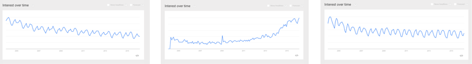

--- 
title: "A Minimal Cookbook for your Basic Statistics Needs in R"
author: "Bernard Liew"
date: "`r Sys.Date()`"
output: bookdown::gitbook
documentclass: book
link-citations: yes
mainfont: Arial
monofont: Courier New
monofontoptions: Scale=0.7
bibliography: [book.bib]
site: bookdown::bookdown_site
biblio-style: apalike
---

# Preface {#intro}

The purpose of this book is to help you do stats **EASILY** but not fast at first.


**What this book is**

This books is intended to be a cookbook based approach. It has problems and it has solutions. You will find a similar document ".Rmd" in the supplied folder. Double click it and pressing run will execute everything you see in the PDF. 


**What this book is not**

This book does not cover any one topic in extensive detail. If you are interested in conducting analyses or creating plots not covered in the book, I'm sure you'll find the answer with a quick Google search!

## Why is R so great?

1. R is 100\% free and as a result, has a huge support community. Unlike SPSS, Matlab, Excel and JMP, R is, and always will be completely free. This doesn't just help your wallet - it means that a huge community of R programmers will constantly develop an distribute new R functionality and packages at a speed that leaves all those other packages in the dust! Unlike Fight Club, the first rule of R is "Do talk about R!" The size of the R programming community is staggering. If you ever have a question about how to implement something in R, a quick Poogle\footnote{I am in the process of creating Poogle - Google for Pirates. Kickstarter page coming soon...} search will lead you to your answer virtually every single time.

2. R is the present, and future of statistical programming. To illustrate this, look at the following three figures. These are Google trend searches for three terms: R Programming, Matlab, and SPSS. Try and guess which one is which.

```{r googletrend, echo = FALSE, fig.cap = "Google trends for different statistical package", fig.height=10, fig.width=8,, fig.align='center'}

```

3. R is incredibly versatile. You can use R to do everything from calculating simple summary statistics, to performing complex simulations to creating gorgeous plots. If you can imagine an analytical task, you can almost certainly implement it in R.

4. Using RStudio, a program to help you write R code, You can easily and seamlessly combine R code, analyses, plots, and written text into elegant documents all in one place using Sweave (R and Latex) or RMarkdown. In fact, I translated this entire book (the text, formatting, plots, code...yes, everything) in RStudio using Sweave. With RStudio and Sweave, instead of trying to manage two or three programs, say Excel, Word and (sigh) SPSS, where you find yourself spending half your time copying, pasting and formatting data, images and test, you can do everything in one place so nothing gets misread, mistyped, or forgotten.

5. Analyses conducted in R are transparent, easily shareable, and reproducible. If you ask an SPSS user how they conducted a specific analyses, they will either A) Not remember,  B) Try (nervously) to construct an analysis procedure on the spot that makes sense - which may or may not correspond to what they actually did months or years ago, or C) Ask you what you are doing in their house. I used to primarily use SPSS, so I speak from experience on this. If you ask an R user (who uses good programming techniques!) how they conducted an analysis, they should always be able to show you the exact code they used. Of course, this doesn't mean that they used the appropriate analysis or interpreted it correctly, but with all the original code, any problems should be completely transparent!


## Why R is like a relationship... {#rrelationship}

Yes, R is very much like a relationship. Like relationships, there are two major truths to R programming:

```{r relationship, echo=FALSE, fig.height=10, fig.width=8, fig.cap = "R will become both your best friend and your worst nightmare. The bad times will make the good times oh so much sweeter.", fig.align='left'}
knitr::include_graphics("images/rrelationship.png")
```

1. There is nothing more *frustrating* than when your code does *not* work

2. There is nothing more *satisfying* than when your code *does* work!


Anything worth doing, from losing weight to getting a degree, takes time. Learning R is no different. Especially if this is your first experience programming, you are going to experience a *lot* of headaches when you get started. You will run into error after error and pound your fists against the table screaming: "WHY ISN'T MY CODE WORKING?!?!? There must be something wrong with this stupid software!!!" You will spend hours trying to find a bug in your code, only to find that - frustratingly enough, you had had an extra space or missed a comma somewhere. You'll then wonder why you ever decided to learn R when (::sigh::) SPSS was so "nice and easy."


```{r gosling, echo = FALSE, fig.cap = "When you first meet R, it will look so fugly that you'll wonder if this is all some kind of sick joke. But trust me, once you learn how to talk to it, and clean it up a bit, all your friends will be crazy jealous.", fig.align='center'}
knitr::include_graphics("images/gosling.png")
```

**Fun Fact!** SPSS stands for "Shitty Piece of Shitty Shit". True story.

This is perfectly normal! Don't get discouraged and DON'T GO BACK TO SPSS! That would be quitting on exercise altogether because you had a tough workout.

Trust me, as you gain more programming experience, you'll experience fewer and fewer bugs (though they'll never go away completely). Once you get over the initial barriers, you'll find yourself conducting analyses much, much faster than you ever did before.


## R resources


### R Cheatsheets

```{r rreferencecard, fig.cap= "The R reference card written by Tom Short is absolutely indispensable!", fig.margin = TRUE, fig.align = 'center', echo = FALSE, out.width = "75%"}
knitr::include_graphics(c("images/rreferencess.png"))
```

Over the course of this book, you will be learning *lots* of new functions. Wouldn't it be nice if someone created a Cheatsheet / Dictionary of many common R functions? Yes it would, and thankfully several friendly R programmers have done just that. Below is a table of some of them that I recommend. I highly encourage you to print these out and start highlighting functions as you learn them!

| CheatSheet| Author| Link|
|:------------------------|:-----------|:-----------------------|
|     R Basics| Tom Short |    [https://cran.r-project.org/doc/contrib/Short-refcard.pdf](https://cran.r-project.org/doc/contrib/Short-refcard.pdf)|
|    Advanced R |   Arianne Colton and Sean Chen | [hhttps://www.rstudio.com/wp-content/uploads/2016/02/advancedR.pdf](https://www.rstudio.com/wp-content/uploads/2016/02/advancedR.pdf)|
| Base R | [Mhairi McNeill](http://mhairihmcneill.com/) |http://github.com/rstudio/cheatsheets/raw/master/base-r.pdf|
| Strings | [RStudio](https://www.rstudio.com) | https://github.com/rstudio/cheatsheets/raw/master/strings.pdf|
| Data import| [RStudio](https://www.rstudio.com) | https://github.com/rstudio/cheatsheets/raw/master/data-import.pdf|
|Data transformation| [RStudio](https://www.rstudio.com) | https://github.com/rstudio/cheatsheets/raw/master/data-import.pdf |
|RStudio application| [RStudio](https://www.rstudio.com) | https://github.com/rstudio/cheatsheets/raw/master/rstudio-ide.pdf|
| Plotting with ggplot2 | [RStudio](https://www.rstudio.com) |https://github.com/rstudio/cheatsheets/raw/master/data-visualization-2.1.pdf|
| RMarkdown| [RStudio](https://www.rstudio.com) |https://www.rstudio.com/wp-content/uploads/2015/03/rmarkdown-reference.pdf|


### Getting R help and inspiration online

Here are some great resources for R help and inspiration:

| Site| Description|
|:----------------------------|:-----------------------------------|
|     [www.google.com](http://www.google.com)| Seriously, Google is any programmer's best friend. More likely than not you will be directed to [www.stackoverflow.com](www.stackoverflow.com) or [www.stackexchange.com](www.stackexchange.com)|
|     [www.r-bloggers.com](http://www.r-bloggers.com)| R bloggers is my go-to place to discover the latest and greatest with R.|
|     [blog.revolutionanalytics.com](http://blog.revolutionanalytics.com)| Revolution analytics always has great R related material.|


### Other R books

There are many, many excellent (non-pirate) books on R, some of which are available online for free. Here are some that I highly recommend:

| Book| Description|
|:----------------------------|:-----------------------------------|
|     [R for Data Science by Garrett Grolemund and Hadley Wickham](http://r4ds.had.co.nz/)| The best book to learn the latest tools for elegantly doing data science.|
|     [R Graphics Cookbook by Winston Chang](http://www.cookbook-r.com/Graphs/)| is indispensible for creating graphics.|
|     [R Cookbook by James (JD) Long and Paul Teetor](https://rc2e.com/index.html)|is a useful bag of tips and tricks to get started with R .|
|     [Discovering Statistics with R by Field, Miles and Field](https://www.amazon.com/Discovering-Statistics-Using-Andy-Field/dp/1446200469/ref=sr_1_2?ie=UTF8&qid=1487759316&sr=8-2&keywords=statistics+with+r)| A classic text focusing on the theory and practice of statistical analysis with R|

